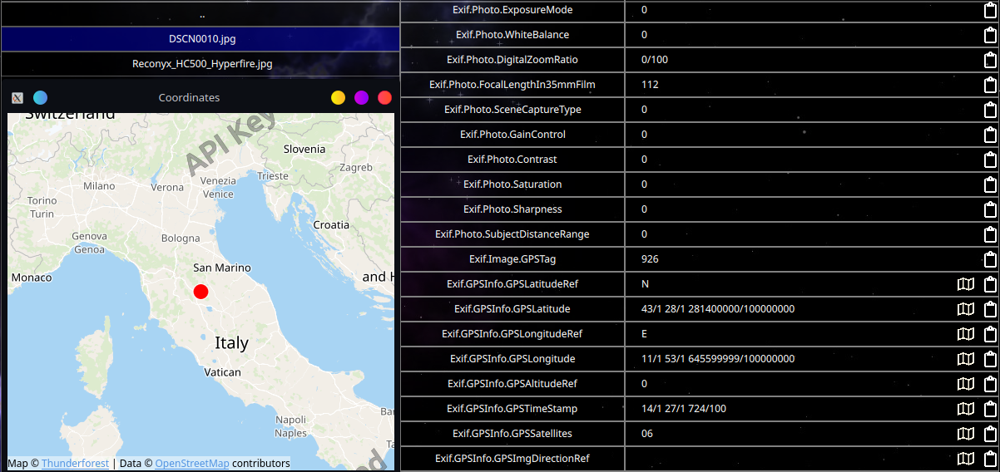

# QMeta Browser



## Description:
Introducing a simple  file browser designed for exploring image files metadata. With this application, users can effortlessly navigate through their image collection, gaining insights into crucial details like camera settings, date taken, and resolution. Additionally, for images containing location information, the application provides the option to open a map.

## Dependencies:
Project was built with Qt 6.7 using CMake version 3.28.1, Ninja version 1.11.1 and GCC 12.2.1 x86_64-pc-linux-gnu.

## Installation
1. Set CMake prefix path to your QT installation in CMakeLists.txt like:
```bash
set(CMAKE_PREFIX_PATH "/home/<user>/Qt/6.7.0/gcc_64" ${CMAKE_PREFIX_PATH})
```
2. Create build directory in project root directory and "cd" into it:
```bash
mkdir build
cd build
```
3. Run cmake from within build folder using the following command (generate configuration files):
```bash
cmake -DCMAKE_C_COMPILER:FILEPATH=<path-to-c-compiler> -DCMAKE_CXX_COMPILER:FILEPATH=<path-to-cpp-compiler> .. -G Ninja
```
4. Run ninja inside build directory to compile project:
```bash
ninja
```


